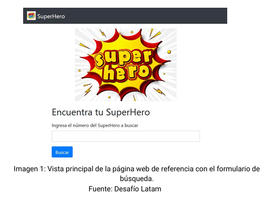
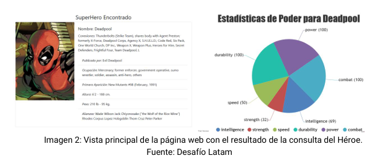

# Desafío Fundamentos de programación en JavaScript

💡 Realizado [cristiandpto23](https://github.com/cristiandpto23) con HTML, CSS ,JS, JQuery y CanvasJS 
ℹ Front-End G17 - Desafío Latam 
🔗 Desplegado en GitHub Pages [aquí](https://cristiandpto23.github.io/desafio-fundamentos-de-programacion-en-javascript/)

## Introducción
En esta prueba validaremos nuestros conocimientos de Fundamentos de programación en JavaScript.

## Descripción

La revista semanal SuperHero Chile, se encuentra en plena fase de masificación mediante medios digitales, por lo tanto, se diseñó un plan para atraer más clientes y así aumentar el tráfico en su página web.

En base a lo anterior, usted ha sido contratado para crear una aplicación dinámica que permita a los usuarios buscar un superhéroe y visualizar información referente al personaje  buscado.

Ahora bien, para obtener la información necesaria de los Superhéroes se deberá consultar a la API denominada “SuperHero API”, la cual, se encuentra disponible en https://www.superheroapi.com/. Esta API en particular requiere de una clave o access-token, que se entrega al iniciar sesión con una cuenta de Facebook. Recuerda leer la documentación disponible en la API y revisar el material llamado Apoyo Prueba - Encuentra tu SuperHero. 

## Requerimientos

1. Crear la estructura básica para la página web implementando HTML, que incluya un formulario de búsqueda. Utilizar etiquetas semánticas de HTML5 para definir y separar las secciones.

2. Agregar estilos mediante frameworks o librerías de CSS por ejemplo menús de navegación y botones. Los estilos los puedes agregar a tu gusto. Como se muestra en la imagen de referencia.

3. Una vez ingresado el número del héroe a buscar y después de realizar un click sobre el botón de búsqueda, se debe capturar y validar la información para evitar búsquedas que contengan algún texto diferente a números y mostrar la información dinámicamente mediante la librería jQuery y CanvasJS con un gráfico de pastel. Para lograr todo esto se debe: 

    3.1 Capturar la información ingresada mediante eventos del DOM con jQuery.

    3.2 Implementar funciones para separar la captura de la información ingresada por el usuario con la consulta a la API.

    3.3 Comprobar la información ingresada por el usuario, la cual, solo debe ser un número. 

    3.4 Consultar la API mediante AJAX con la sintaxis de jQuery.

    3.5 Renderizar la información recibida por la API dinámicamente utilizando tarjetas (card) de Bootstrap.

    3.6 Utilizar ciclos y métodos para arreglos u objetos que permitan recorrer, ordenar y mostrar la información.

    3.7 Emplear la librería de gráficos CanvasJS, para mostrar dinámicamente información específica de cada superhéroe.

    3.8 Implementar estructuras condicionales para generar alertas cuando existan errores en la búsqueda.

En la siguiente imagen, se puede observar el resultado de la búsqueda del id número: 213. 

